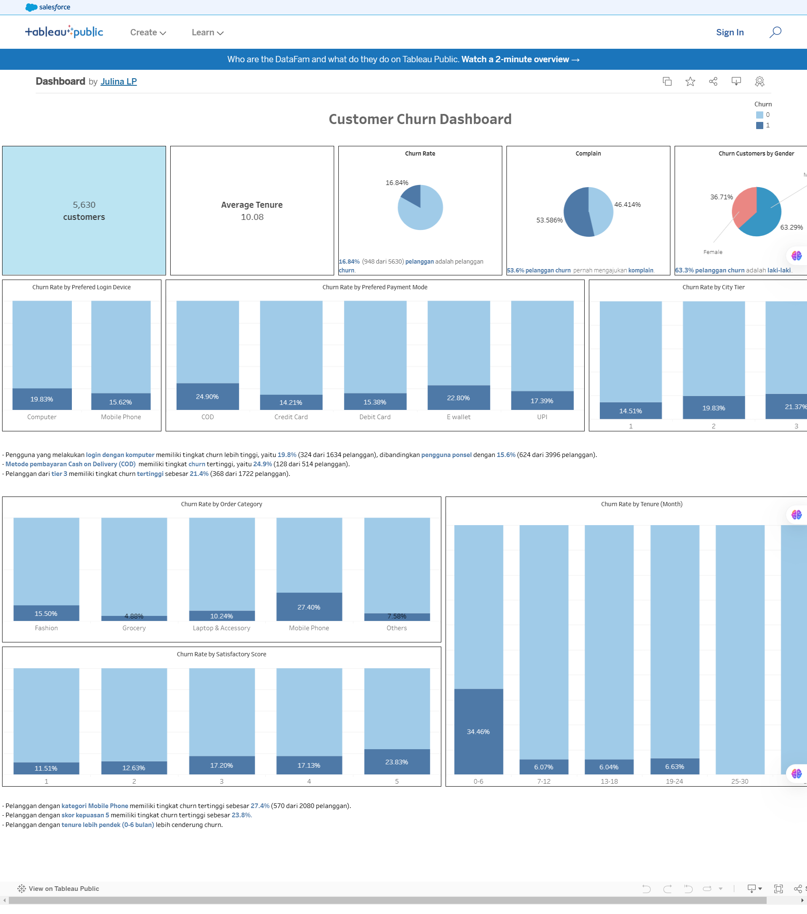

# Ecommerce Customer Churn Analysis and Prediction

## **📌 Pendahuluan**
E-commerce menghadapi tantangan besar dalam mempertahankan pelanggan. Pelanggan yang meninggalkan platform (*churn*) sering kali menciptakan kerugian finansial dan mengurangi efisiensi bisnis. Untuk itu, kami mengembangkan analisis mendalam dan model prediktif untuk meminimalkan churn pelanggan. Dengan pendekatan berbasis data, kami ingin memastikan bahwa pelanggan tetap setia melalui strategi yang personal, relevan, dan berbasis pada wawasan yang dapat ditindaklanjuti.

---

## **🧩 1. Definisi Masalah**
### **Stakeholder Utama:**
- **Tim Manajemen:** Membutuhkan wawasan strategis untuk mengurangi churn pelanggan.
- **Divisi Retensi Pelanggan:** Memerlukan identifikasi pelanggan berisiko tinggi untuk menerapkan strategi proaktif.

### **Tujuan Utama:**
1. **Identifikasi Risiko Churn:** Membangun model prediksi untuk mengidentifikasi pelanggan yang berisiko tinggi meninggalkan platform.
2. **Efisiensi Alokasi Sumber Daya:** Memberikan wawasan untuk mengoptimalkan upaya retensi hanya pada pelanggan yang paling berisiko, sehingga efisiensi operasional meningkat.
3. **Meningkatkan Loyalitas dan Profitabilitas:** Mengurangi churn terbukti lebih hemat biaya dibandingkan akuisisi pelanggan baru. Ini membantu perusahaan mempertahankan pelanggan bernilai tinggi dan memperpanjang siklus hidup mereka.

### **Signifikansi Masalah:**
- **Finansial:** Biaya mempertahankan pelanggan yang ada hingga 5x lebih rendah dibandingkan memperoleh pelanggan baru.
- **Operasional:** Tanpa model prediktif, upaya retensi bersifat reaktif dan sering kali tidak efisien.
- **Kompetitif:** Dalam industri yang kompetitif seperti e-commerce, pengalaman pelanggan yang unggul adalah kunci untuk mempertahankan pangsa pasar.

---

## **📊 2. Pemahaman Data**
### **Ikhtisar Dataset:**
Dataset yang digunakan mencakup **20 fitur** dengan total **5630 entri**, termasuk atribut demografis, transaksi, dan perilaku pelanggan. Kolom utama mencakup:
1. **Numerikal:** *Tenure*, *HourSpendOnApp*, *CashbackAmount*, *DaySinceLastOrder*.
2. **Kategorikal:** *PreferredLoginDevice*, *PreferredPaymentMode*, *MaritalStatus*.

### **Ciri Utama Dataset:**
1. **Kehilangan Data:**
   - Fitur seperti *Tenure* dan *HourSpendOnApp* memiliki nilai hilang yang perlu diimputasi.
2. **Ketidakseimbangan Kelas:**
   - Sebagian besar pelanggan tidak churn (≈80%), menciptakan ketidakseimbangan yang signifikan.
3. **Outlier:**
   - Hampir semua kolom numerikal memiliki outlier, kecuali *SatisfactionScore*.

### **Distribusi Utama:**
1. **Tenure:** Mayoritas pelanggan memiliki masa keanggotaan pendek (0–10 bulan).
2. **HourSpendOnApp:** Sebagian besar pelanggan menghabiskan waktu 2–4 jam di aplikasi.
3. **CashbackAmount:** Cashback rata-rata berkisar antara 100–200 satuan.
4. **DaySinceLastOrder:** Pesanan terakhir umumnya dilakukan dalam 0–10 hari terakhir.

---

## **🔍 3. Eksplorasi Data**
### **Boxplot Analisis:**
#### **Tenure:**
- **Observasi:** Median pelanggan churn berada di bawah 5 bulan, sementara non-churn mendekati 10 bulan.
- **Insight:** Tenure pendek mencerminkan kurangnya keterlibatan awal pelanggan.
- **Rekomendasi:** Implementasi program onboarding yang agresif selama 3-6 bulan pertama.

#### **Cashback Amount:**
- **Observasi:** Pelanggan non-churn menerima cashback lebih tinggi (median ≈ 175) dibandingkan churn (median ≈ 150).
- **Rekomendasi:** Tingkatkan cashback untuk pelanggan dengan risiko churn tinggi melalui program berbasis aktivitas.

#### **Hour Spend on App:**
- **Observasi:** Pelanggan churn memiliki waktu penggunaan aplikasi yang lebih rendah (median ≈ 2.5 jam).
- **Rekomendasi:** Dorong keterlibatan dengan fitur personalisasi, gamifikasi, dan rekomendasi berbasis preferensi pelanggan.

---

## **📈 4. Korelasi Antar Fitur**
### **Heatmap Korelasi:**
- **OrderCount ↔ CashbackAmount:** Korelasi positif menunjukkan bahwa pelanggan yang lebih sering memesan menerima lebih banyak cashback.
- **Tenure ↔ Churn:** Korelasi negatif; pelanggan dengan tenure lebih panjang cenderung tidak churn.
- **SatisfactionScore ↔ Churn:** Pelanggan dengan skor kepuasan rendah lebih cenderung churn.

---

## **📉 5. Evaluasi Metrik Model**
### **Jenis Kesalahan:**
1. **False Positive (FP):**
   - Pelanggan yang sebenarnya tidak churn salah diklasifikasikan sebagai churn.
   - **Dampak:** Biaya promosi yang tidak perlu.
2. **False Negative (FN):**
   - Pelanggan yang sebenarnya churn tidak terdeteksi.
   - **Dampak:** Kehilangan pendapatan.

### **Metrik Evaluasi:**
- **F1-Score:** Keseimbangan antara precision dan recall, ideal untuk data tidak seimbang.
- **ROC-AUC:** Menilai kemampuan model dalam memisahkan kelas churn dan non-churn.

---

## **🛠 6. Implementasi Model**
### **Pipeline Modeling:**
1. **Data Preprocessing:** Imputasi nilai hilang, encoding kategorikal, scaling numerikal.
2. **Oversampling:** Menggunakan *RandomOverSampler* untuk mengatasi ketidakseimbangan kelas.
3. **Model Benchmarking:**
   - Algoritma diuji: Logistic Regression, Random Forest, XGBoost, LightGBM.
   - **XGBoost:** Terbukti memberikan performa terbaik dengan **F1-Score 0.97**.

### **Hyperparameter Tuning:**
- Menggunakan *RandomizedSearchCV* untuk menemukan parameter optimal:
  - `n_estimators`, `max_depth`, `learning_rate`, dll.
- **Hasil:** Peningkatan F1-Score dari 0.96 menjadi 0.97.

---

## **📌 7. Analisis Biaya Kesalahan**
### **False Positive (FP):**
- **Kerugian:** Biaya promo tidak efektif, Rp200.000 per pelanggan.
- **Total Kerugian:** Rp2.400.000 untuk 12 FP.

### **False Negative (FN):**
- **Kerugian:** Kehilangan pelanggan, Rp500.000 per pelanggan.
- **Total Kerugian:** Rp5.500.000 untuk 11 FN.

### **Efisiensi Model:**
- **Pengurangan Kerugian Total:** Dari potensi Rp20.000.000 menjadi Rp7.900.000.

---

## **🧠 8. Insight Strategis**
1. **Faktor Utama Churn:**
   - Tenure pendek.
   - Cashback rendah.
   - Keterlibatan aplikasi rendah.
2. **Segmen Rentan:**
   - Pelanggan pria, kota kecil, atau dengan keluhan tidak terselesaikan.

### **Rekomendasi Strategis:**
1. **Program Loyalitas Baru:** Fokus pada pelanggan dengan tenure pendek dan cashback rendah.
2. **Onboarding Proaktif:** Insentif selama 3 bulan pertama.
3. **Peningkatan Logistik:** Perbaikan pengalaman pengiriman untuk pelanggan di wilayah jauh.

---

## **📌 Kesimpulan**
1. Pelanggan yang berisiko churn seringkali adalah mereka yang merasa kurang terlibat secara emosional maupun fungsional dengan layanan e-commerce ini. Mereka cenderung mencari pengalaman yang lebih baik, harga yang lebih kompetitif, atau layanan yang lebih sesuai dengan kebutuhan spesifik mereka. Sosok ini bisa digambarkan sebagai "pelanggan pengelana," yang selalu menjelajahi opsi lain karena merasa layanan saat ini tidak cukup memuaskan, baik dari segi kenyamanan, kecepatan, atau insentif yang mereka harapkan. Mereka cenderung memiliki ekspektasi tinggi, tapi dengan toleransi rendah terhadap ketidaksesuaian, menjadikan mereka kelompok yang memerlukan perhatian khusus dan pendekatan personal agar tetap setia.
2. Model XGBoost yang telah disesuaikan menunjukkan performa luar biasa dengan **f1-score macro sebesar 0.97**, yang mencerminkan keseimbangan antara presisi dan recall di kedua kelas (churn dan non-churn). Dengan tingkat akurasi keseluruhan 98%, model ini sangat andal dalam memprediksi pelanggan yang berpotensi churn (kelas 1) maupun yang tetap loyal (kelas 0). Namun, mempertahankan **f1-score** di tingkat ini sangat penting karena secara langsung memengaruhi kemampuan kami untuk menangani churn pelanggan secara akurat. *Siapa* yang akan terkena dampaknya? Pelanggan berisiko tinggi. *Apa* yang dapat kami lakukan? Memanfaatkan prediksi ini untuk mengidentifikasi mereka lebih awal. *Di mana* dampaknya terlihat? Pada strategi retensi kami. *Kapan* harus diterapkan? Segera, sebelum pelanggan churn. *Mengapa* ini penting? Karena setiap kesalahan deteksi bisa berarti kehilangan pelanggan atau pengalokasian sumber daya yang salah. *Bagaimana* kami dapat meningkatkan f1-score lebih lanjut? Dengan pengayaan data, seperti menambahkan variabel pengalaman pelanggan, dan melakukan iterasi model. Dengan pendekatan ini, kami dapat memaksimalkan dampak dari strategi pencegahan churn dan mempertahankan lebih banyak pelanggan di masa depan.
3. Penerapan sistem Machine Learning berbasis XGBoost telah memberikan peningkatan signifikan dalam efisiensi prediksi risiko churn, dengan F1-Score sebesar 0.94 pada yang berisiko churn, mencerminkan keseimbangan optimal antara precision (0.94) dan recall (0.94). Sebelum menggunakan model prediktif, metode manual atau rule-based menghasilkan kesalahan yang lebih besar, yaitu sekitar 50 False Positives (FP) dan 20 False Negatives (FN), dengan potensi total kerugian mencapai Rp20.000.000. Kerugian ini berasal dari Rp10.000.000 akibat FP (50 pelanggan x Rp200.000) dan Rp10.000.000 akibat FN (20 pelanggan x Rp500.000). Setelah penerapan model XGBoost, jumlah kesalahan dapat ditekan menjadi 12 FP (Rp2.400.000 kerugian) dan 11 FN (Rp5.500.000 kerugian), sehingga total kerugian berkurang menjadi hanya Rp7.900.000, mencerminkan efisiensi biaya lebih dari 60%. Dengan hanya 6% promo salah sasaran dan 94% pelanggan berisiko churn terdeteksi, model ini lebih akurat dan efektif dibandingkan metode sebelumnya, memberikan dampak positif terhadap Return on Investment (ROI) dengan rata-rata kerugian akibat kesalahan prediksi turun menjadi hanya Rp701.500 per 100 pelanggan. XGBoost menjadi solusi terukur dan strategis dalam mengoptimalkan retensi pelanggan.
---

## **🚀 Rekomendasi**
1. Kami merekomendasikan penerapan model Machine Learning berbasis XGBoost untuk bisnis yang memiliki basis pelanggan besar dan ingin meningkatkan retensi pelanggan secara efisien, seperti e-commerce, layanan berlangganan, fintech, atau sektor retail online. Model ini secara otomatis memproses data pelanggan setiap bulan, memanfaatkan fitur seperti tenure, jumlah order, waktu terakhir transaksi, dan pola cashback untuk mengidentifikasi pelanggan berisiko churn (klasifikasi 1). Setelah pelanggan berisiko terdeteksi, sistem dapat langsung memicu pemberian promo personal, seperti cashback atau kupon, berdasarkan data historis pelanggan. Untuk implementasi, bisnis perlu mengintegrasikan model ini ke dalam sistem Customer Relationship Management (CRM) atau data warehouse mereka. Selain itu, proses harus diselaraskan dengan kebijakan bisnis melalui diskusi bersama tim stakeholder untuk menentukan kriteria pemberian promo, seperti batasan anggaran dan tipe insentif yang relevan. Dengan penerapan ini, bisnis dapat mengurangi churn secara signifikan, meningkatkan loyalitas pelanggan bernilai tinggi, dan mengoptimalkan Return on Investment (ROI), sambil menjaga efisiensi operasional melalui otomatisasi.
2. Untuk menghadapi "pelanggan pengelana" yang memiliki ekspektasi tinggi tetapi toleransi rendah terhadap ketidaksesuaian, rekomendasi kami sangat relevan. Dengan fokus pada personalisasi pengalaman pelanggan, seperti memberikan penawaran eksklusif dan relevan, kami dapat memenuhi kebutuhan emosional dan fungsional mereka dengan lebih baik. Selain itu, peningkatan kualitas layanan logistik secara langsung menjawab kebutuhan kenyamanan dan kecepatan yang mereka harapkan. Melalui penggunaan data prediktif, kami dapat mengidentifikasi kelompok pelanggan ini lebih awal, memungkinkan kami untuk memberikan intervensi yang tepat waktu, seperti memberikan diskon menarik atau layanan pelanggan proaktif. Strategi ini bertujuan untuk menciptakan keterlibatan yang lebih dalam, menjaga loyalitas mereka, dan memastikan pengalaman yang lebih baik sehingga pelanggan merasa bahwa platform ini adalah pilihan terbaik mereka, mencegah mereka menjelajahi opsi lain.

## **📌 Link Tableau**
https://public.tableau.com/app/profile/julina.lp/viz/Dashboard_17322460766480/CustomerChurnDashboard?publish=yes

